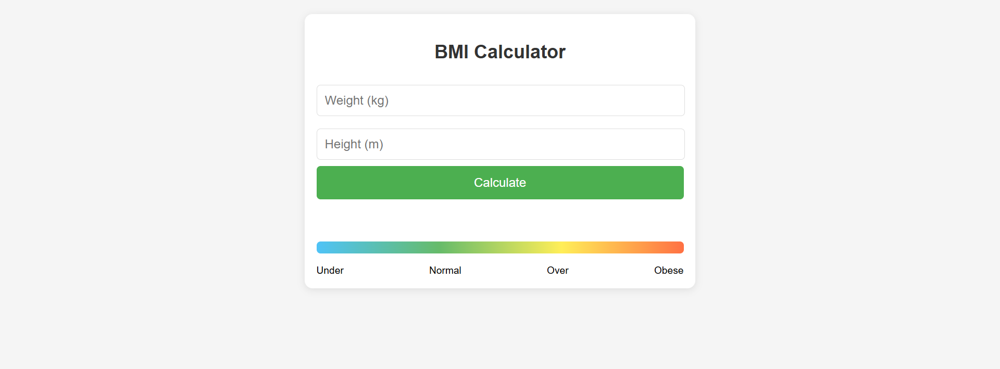

# BMI Calculator

A simple tool to calculate your Body Mass Index (BMI).

## How to Use

1. Open the `BMI.html` file in your web browser
2. Enter your weight in kilograms
3. Enter your height in meters
4. Click "Calculate" button
5. See your BMI result and health category

## What is BMI?

BMI is a number calculated from your weight and height. It helps check if your weight is healthy.

### BMI Categories:
- Under 18.5 = Underweight
- 18.5-24.9 = Normal
- 25-29.9 = Overweight
- 30 or more = Obese

## Author

Erfan Sani
